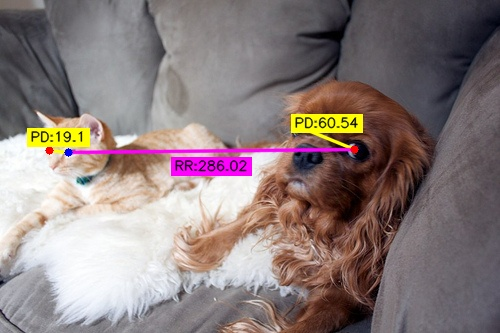
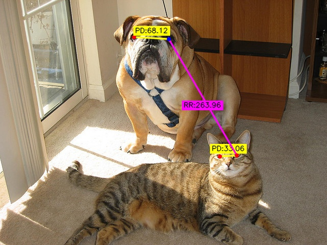
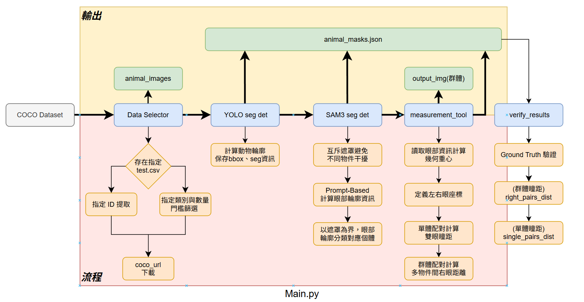

# SAM3 Animal Eyes Distance Measurement System


## :white_check_mark: 專案介紹

#### 本專案是一個基於深度學習的自動化動物眼部特徵分析系統。結合 **YOLOv11** 的實例分割能力與 **SAM3 (Segment Anything Model 3)** 的提示詞精準邊緣提取技術，實現對動物瞳距（PD）精準測量 。
<p align="center">
  
  
</p>

## :white_check_mark: 技術棧說明
- **核心算法**: YOLOv11 (Object Detection), SAM3 (Precision Segmentation)
- **開發語言**: Python 3.10+
- **影像處理**: OpenCV, Pillow, NumPy

### 📦 模組說明 (Modules)

本系統採模組化設計，將數據處理、模型推論與幾何運算解耦（Decoupling），以下為各核心模組之功能說明：

#### 1. 數據採集模組：`data_selector.py`
* **職責**：精確控制數據輸入。
* **功能**：
    * 支援動態篩選機制：優先讀取 `test.csv` 指定名單。
    * 若無指定名單，則根據 `Config.ini` 內的類別限制（如 `dog`, `cat`）與數量門檻（`min_animal_count`），自動化從 COCO 資料庫中篩選並下載目標影像。

#### 2. 一階段分割模組：`animal_extractor.py`
* **職責**：動物輪廓偵測以及ROI區域建立。
* **功能**：
    * 調用 **YOLOv11-seg** 進行全圖實例分割。
    * 提取目標動物的 **Bounding Box (BBox)** 與 **Segmentation Mask**，並結構化儲存至 `animal_masks.json` 作為系統的中間交換格式。

#### 3. 二階段眼部分割模組：`eyes_extractor.py`
* **職責**：眼部輪廓偵測。
* **功能**：
    * 基於 **SAM3 (Segment Anything Model 3)**，以 YOLO 產出的 BBox 為 Prompt 導引。
    * **自動化推理**：無需人工提示點，自動提取高解析度的眼部邊緣資訊，並將其回填至 JSON 標籤中。

#### 4. 量測模組：`measurement_tool.py` 
* **職責**：空間分析與數值計算。
* **功能**：
    * **重心演算法 (Centroid Calculation)**：
        系統不採用簡單的座標平均，而是利用 OpenCV 的 **Moments (影像矩)** 演算法計算複雜多邊形的幾何中心，確保測量點具備物理代表性。
    * **多維度產出**：
        1. **單體瞳距 (Intra-object)**：計算同一生物的雙眼距離。
        2. **群體配對 (Inter-object)**：計算場景中不同物體間（如兩隻狗）的右眼相對距離。

### 🧠 系統架構圖 (Structure)
<div align="center">
  
</div>

## :white_check_mark: 專案準備

```bash
git clone [https://github.com/ChengShaoFong/sam3-eyes-dist-measure.git](https://github.com/ChengShaoFong/sam3-eyes-dist-measure.git)
cd sam3-eyes-dist-measure
```
## :white_check_mark: 下載模型權重

由於模型權重檔案體積較大，未包含在 Git 倉庫中。執行程式前，請確保已手動下載以下權重檔並放置於指定路徑：

#### 1. YOLOv11 Segmentation
- **檔案名稱**：[`yolo11l-seg.pt`](https://github.com/ultralytics/assets/releases/download/v8.3.0/yolo11l-seg.pt)
- **存放路徑**：`./` (專案根目錄)
- **用途**：負責初始影像的實例分割與動物類別偵測。系統會自動提取其產出的 **Bounding Box (BBox)** 與 **Segmentation Mask**，作為下一階段 SAM3 的自動化提示輸入。

#### 2. SAM3 Checkpoint 
> [!IMPORTANT]
> > **使用須知**：在使用 SAM 3 之前，請先申請存取 [SAM 3 Hugging Face](https://huggingface.co/facebook/sam3) 程式碼庫中的檢查點。申請批准後，您需要進行身份驗證（如使用 `huggingface-cli login`）才能下載該權重檔。
- **檔案名稱**：[`config.json`](https://huggingface.co/facebook/sam3/blob/main/config.json)、[`sam3.pt`](https://huggingface.co/facebook/sam3/blob/main/sam3.pt)
- **建立並存放路徑**：`segmentation/sam3/checkpoints/`
- **用途**：接收來自 YOLO 的 Mask 區域後，應用提示詞（Prompt）自動化機制，針對眼部特徵進行二次高精細邊緣提取與優化，**實現無需手動點擊的端到端（End-to-End）精確測量**。

## :white_check_mark: 下載資料集

由於標準 COCO 資料集體積過於龐大（數百 GB），本專案採用**動態篩選下載策略**，僅針對目標動物類別進行精確採集，以節省存儲空間並提升運算效率。
請先至 [COCO Dataset 官網](https://cocodataset.org/#download) 下載 [`annotations_trainval2017.zip`](http://images.cocodataset.org/annotations/annotations_trainval2017.zip)，解壓縮後將 `instances_train2017.json` 放置於 `data/` 目錄下。

  
## :white_check_mark: Config.ini 配置

本專案使用 `config.ini` 管理所有運行參數，方便快速調整實驗設定：
- **數據準備 (`data_prep`)**: 可設定目標類別 (如 `dog`, `cat`) 及下載限制 以及 自定義test.csv圖片 ( 從指定COCO.json中下載 )。
- **路徑管理 (`paths`)**: 自定義數據存放、遮罩結果 (JSON) 與視覺化輸出路徑。
- **模型載入 (`models`)**: 指定 YOLOv11 與 SAM3 的權重路徑。
- **運行開關 (`flags`)**: 控制是否顯示即時視覺化結果。

## :white_check_mark: 本地運行步驟
```
# 1. 建立環境
conda create -n {env} python=3.10
conda activate {env}

# 2. 安裝依賴
pip install -r requirements.txt

# 3. 執行主程式
python main.py 
```

 
## :white_check_mark: Docker 部署指令
```
# 使用 Docker Compose 進行編譯與啟動
docker compose build
docker compose up -d
```


## QA 

> ### Q1. 請用 COCO 資料集 , 挑出有兩隻動物(含或以上)的圖片 , 動物任選
- #### A1. 使用 pycocotools 建立 AnimalDataSelector 模組。透過 getCatIds 鎖定特定動物類別（如貓、狗），並利用 getAnnIds 過濾單張影像內標註數量 $\ge 2$ 的圖片。支援 CSV 指定模式與自動篩選模式，能精準提取多目標場景進行後續分析。
--- 
> ### Q2. 請用 Segmentation 模型將動物的輪廓 / 動物的眼睛 個別框出
- #### A2. 採用 兩階段分割架構：
  -  動物物件定位、輪廓偵測：使用 YOLOv11-seg 進行全圖推論，提取動物主體的實例分割遮罩（Mask）、物件框位置 (Bbox)。
  -  眼部輪廓偵測：以 YOLO 的 BBox 為導引，利用 SAM3 (Segment Anything Model 3) 並搭配文字提示（Prompt: "eyes"），在互斥遮罩環境下精確提取眼部輪廓資訊。
---
> ### Q3. 請量測每隻動物 , 雙眼的距離
- #### A3. 詳見專案視覺化輸出與數據報告（單體瞳距 PD 量測）。
--- 
> ### Q4. 請量測任意兩隻動物 , 右眼的距離
- #### A4. 詳見專案視覺化輸出與數據報告（跨個體間距 RR 量測）。
--- 
> ### Q5. 解釋使用甚麼AI模型 , 為什麼 , 評估標準公式是甚麼
- #### A5. 動物輪廓&眼部輪廓:
  - YOLOv11-seg : 具備極高的推論速度與實例分割能力，負責從全圖中快速過濾背景，並定義各動物個體的專屬遮罩（Animal Mask）與邊界框（BBox），主要是為了輔助SAM3在提取眼部輪廓時能有效分類物件。
  - 選擇用SAM3 而非傳統動物姿態模型等等，想嘗試驗證Zero-shot泛化能力，透過 Text-Prompt 導引，在不需特定數據集（如 AP-10K）微調的情況下，對於陌生個體的穩定性以及集成可能性。
--- 
> ### Q6. 解釋量測的方式與公式 , 以及怎麼驗證
- #### A6. 量測&距離&驗證方式:
  - 量測方式：幾何重心法，利用影像矩計算眼部輪廓遮罩的幾何重心。抵消因眼部形狀不規則或邊緣雜訊產生的定位誤差
      - 計算公式：利用零階矩 ($m_{00}$) 與一階矩 ($m_{10}, m_{01}$) 算出重心座標 ($\bar{x}, \bar{y}$):
      > $$\bar{x} = \frac{m_{10}}{m_{00}}, \quad \bar{y} = \frac{m_{01}}{m_{00}}$$
      
  - 距離計算公式：取得左、右眼重心座標後，使用 歐幾里得距離 (Euclidean Distance) 公式計算像素距離
      - 單體瞳距 (PD)：同一動物個體內的雙眼距離。
      - 群體間距 (RR)：不同動物個體間「右眼對右眼」的直線距離 ( 專案內定義右眼為影像中 $x$ 座標較大者（畫面右側），而非動物主體的生物解剖方位)。
      > $$Distance = \sqrt{(x_2 - x_1)^2 + (y_2 - y_1)^2}$$
      
  - 驗證機制：透過verify_results.py，將系統量測結果與人工標註的Ground Truth(GT)比對，確保數據可靠性
    
      | 影像名稱 (Image Name) | 類型 (Type) | 物件 ID 1 | 物件 ID 2 | 預期距離 (Pixels) |
      | :--- | :--- | :--- | :--- | :--- |
      | `000000018155.jpg` | **Individual** | 0 | - | **60** |
      | `000000018155.jpg` | **Individual** | 1 | - | **19** |
      | `000000018155.jpg` | **Pair** | 0 | 1 | **280** |
      | `000000114269.jpg` | **Individual** | 0 | - | **33** |
       


